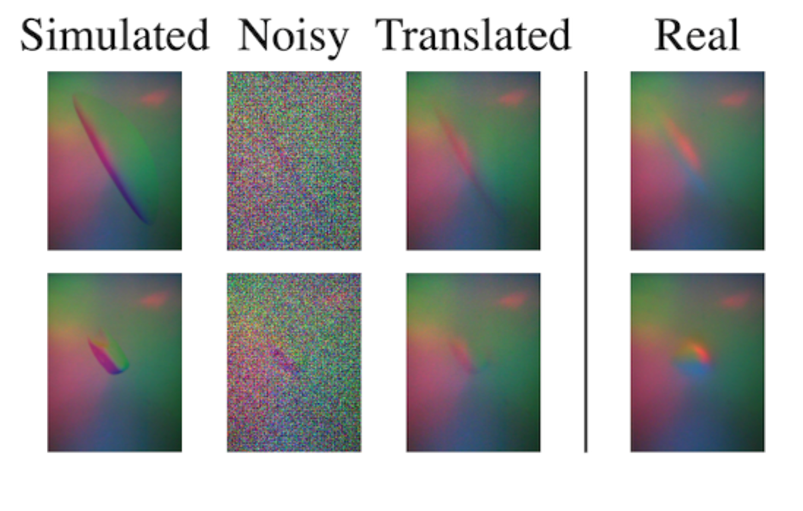
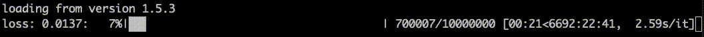
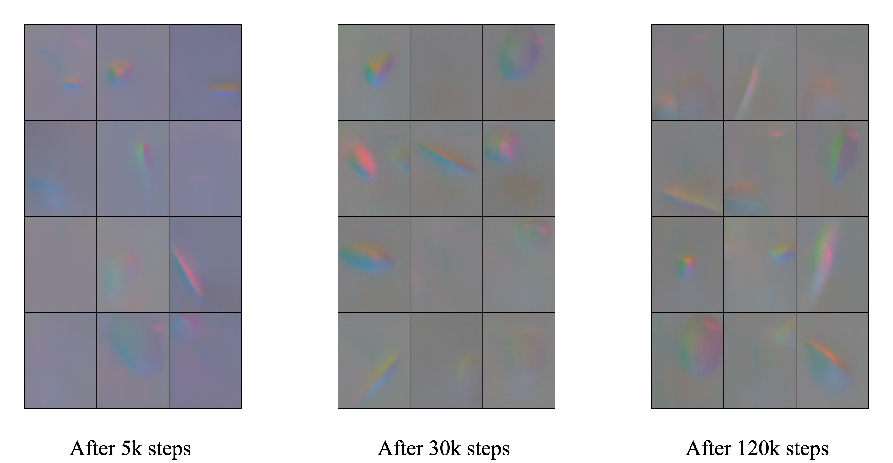

<h1 align="center">
  Sim2Real Bilevel Adaptation for Object Surface Classification using Vision-Based Tactile Sensors
</h1>
<p align="center"></p>

<div align="center">
  <a href="https://www.iit.it/it/people-details/-/people/gabriele-caddeo">Gabriele Caddeo</a> &nbsp; &nbsp;
  <a href="https://www.iit.it/it/people-details/-/people/andrea-maracani">Andrea Maracani</a> &nbsp; &nbsp;
  <a href="https://paoloalfano.com/">Paolo Didier Alfano</a> &nbsp; &nbsp;
  <br>
  <a href="https://www.iit.it/it/people-details/-/people/nicola-piga">Nicola Agostino Piga</a> &nbsp; &nbsp;
  <a href="https://web.mit.edu/lrosasco/www/">Lorenzo Rosasco</a> &nbsp; &nbsp;
  <a href="https://lornat75.github.io/">Lorenzo Natale</a> &nbsp; &nbsp;
  <br/>
  International Conference on Robotics and Automation 2024(<a href="https://2024.ieee-icra.org/">ICRA</a>)<br>
  <br>
</div>

<div align="center">
  <a href="https://arxiv.org/abs/2311.01380"><b>Paper</b></a> |
  <a href=""><b>Video</b></a>
</div>

## Table of Contents

- [Updates](#updates)
- [Description](#description)
- [Setup](#setup)
- [License](#license)
- [Citing this paper](#citing-this-paper)


## Updates

2023-09-15 - The repository has been created. Code to be released.

2024-04-01 - The code will be released

2024-04-17 - Instruction for installation released

## Description

This is the the repository related to the Sim2Real Bilevel Adaptation for Object Surface Classification using Vision-Based Tactile Sensors paper, published at the International Conference on Robotics and Automation 2024 (ICRA 2024).<br>
We address the Sim2Real gap in vision-based tactile sensors for object surface classification. We use a Diffusion Model to translate simulated images into real ones, augmenting a small dataset of real-world images.<br>
This boosts the classifier accuracy to 81.9%, a significant improvement over using only simulated images (34.7%). We also validate the approach on a 6D object pose estimation task using tactile data.<br>

<div align="center">
  
</div>

Additionally, our approach underwent real-world testing on multiple YCB objects to further validate its effectiveness.<br>


## Setup

### 1 Clone this repository
To clone this repository you can launch the following command
```bash
git clone https://github.com/hsp-iit/sim2real-surface-classification.git
```

### 2 Create and activate the virtual environment
To create and activate the virtual environment to work with this repository you can launch the following command
```bash
conda env create --name ldm2 -f environment.yml 
conda activate ldm2
```
Environment creation will take some time.

### 3 Train the Diffusion Model
The dataset is a torchvision ImageFolder so it should be in the format

```
-my_dataset_name
  -folder1_name
    image1
    ...
  -folder2_name
    image1
    ...
  - ...
```

Before starting the training itself, accelerate library can be configured to parrallelize the training process via the following command
```bash
accelerate config
```
To train the diffusion model launch the 

```bash
bash src_diffusion/train_diffusion.sh
```

setting the paths for the data. The number of gpus involved in the training process can be configured from the `train_diffusion.sh` script via the `GPUS` parameter.<br>
If everything is working fine a progress bar like the following one should appear:<br>
<br>

<div align="left">
  
</div>
<br>

Training process can be interrupted safely as the script will save automatically the trained model in the `results_folder` every 1000 training steps. Saved models are retrieved at the beginning of a new run.<br>
While saving the model in the `results_folder` the script will also produce a .png output to check qualitatively the unfolding of the training process. If you are working with vision-based tactile sensors, output could look similar to the following:<br>
<br>

<div align="center">
  
</div>

### 4 Use the diffusion model for conversion
Once the diffusion model is trained, it can be used to convert the images from simulated to real context. To perform such operation run:

```bash
bash src_diffusion/convert_dataset.sh
```

Trained model can be selected and configured via the `CKPT_PATH` and `CONFIG_PATH` variables.<br>
Output images will be stored in the `OUT_PATH` folder.

### 5 Train the adversarial classifier
To fully reproduce the paper results, an adversarial classifier can be trained. Best results can be achieved by running:

```bash
bash src_training_classifier/train_dann_ours.sh
```

As the classifier is composed by a bottleneck, a classifier and an adversarial part, a different learning rate for every part is proposed in the `src_training_classifier/config/dann_hparams.yaml`. By default, each one of them is `1e-2`.<br>
Moreover, as the loss is a combination of both classifier and adversarial loss, the adversarial loss can be weighted via the `beta` hyperparameter in the aforementioned configuration file. By default `beta=1.2`. Notice that running the scripts with `beta=0` corresponds to ignore the adversarial part.<br>
All the other models used to reproduce the results presented in our paper can be trained by running the scripts:
* `bash src_training_classifier/train_dann_simulated.sh`<br>
To train the classifier on simulated images only
* `bash src_training_classifier/train_dann_tactile.sh`<br>
To train the classifier with the tactile diffusion approach

### 6 Test the classifier
To obtain the results, we can load the trained classifier and test it on real-world data. To perform such operation run:

```bash
bash src_training_classifier/load_model_and_test.sh
```

by setting properly the `DATA_TEST`, `CONFIG` and `CKPT` paths.


## License

## Citing this paper
If you appreaciated our work or you find it useful for your reasearch, feel free to cite our paper
```
@misc{caddeo2023sim2real,
      title={Sim2Real Bilevel Adaptation for Object Surface Classification using Vision-Based Tactile Sensors}, 
      author={Gabriele M. Caddeo and Andrea Maracani and Paolo D. Alfano and Nicola A. Piga and Lorenzo Rosasco and Lorenzo Natale},
      year={2023},
      eprint={2311.01380},
      archivePrefix={arXiv},
      primaryClass={cs.RO}
}
```

## Maintainer

This repository is maintained by:

| | |
|:---:|:---:|
| [](https://github.com/gabrielecaddeo) | [@gabrielecaddeo](https://github.com/gabrielecaddeo) |